# Vanguard Swiss-Industrial E-Commerce Platform

Una plataforma de comercio electrónico de vanguardia diseñada bajo un enfoque arquitectónico e industrial, desarrollada como un **monorepo**. Esta solución proporciona una experiencia de usuario inmersiva combinando capacidades de renderizado 3D en el frontend con una arquitectura robusta, transaccional y escalable en el backend.

El enfoque principal del software es ofrecer un sistema "Plug & Play" altamente modular para tiendas modernas que requieren un alto rendimiento, gestión eficiente del inventario y una interfaz visualmente impactante. Resuelve el problema de la fragmentación entre los sistemas de gestión (API/Base de datos) y la presentación visual, al unificar todo en un único repositorio optimizado y fácil de desplegar.

[](https://nestjs.com/)
[](https://nuxt.com/)
[](https://vuejs.org/)
[](https://www.typescriptlang.org/)
[](https://www.postgresql.org/)
[](https://redis.io/)
[](https://www.prisma.io/)
[](https://threejs.org/)
[](https://tailwindcss.com/)
[](https://www.docker.com/)
[](./LICENSE)

<br>

<div align="center">
  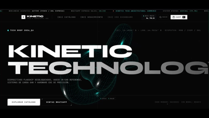
  <p><em>⚡ Demostración en vivo de la plataforma: interfaz brutalista-industrial con renderizado 3D en tiempo real y microanimaciones fluidas.</em></p>
</div>

<br>

## 🚀 Características Principales (Features)

*   **Arquitectura Monorepo:** Separación limpia entre Frontend y Backend en un mismo espacio de trabajo (`npm workspaces`).
*   **Experiencia Inmersiva 3D:** Integración con Three.js para la inspección orbital, iluminación dinámica y renderizado en vivo de modelos 3D (`.gltf`).
*   **Animaciones Avanzadas:** Interfaz cinética con microinteracciones fluidas impulsadas por GSAP y Canvas Confetti.
*   **Integración Cambiaria en Vivo:** Consulta automatizada de la tasa del Banco Central (BCV) para conversión multimoneda (USD / Bolívares) en tiempo real.
*   **Rastreador Satelital de Envíos:** Línea de tiempo interactiva de 5 etapas para seguimiento de pedidos en vivo.
*   **Backend Robusto y Escalable:** Construido sobre NestJS, proporcionando transacciones atómicas de órdenes y arquitectura modular.
*   **Gestión de Base de Datos Eficiente:** PostgreSQL con Prisma ORM para esquemas fuertemente tipados y migraciones declarativas.
*   **Sistema de Caché de Alto Rendimiento:** Integración de Redis para optimización de consultas al catálogo y sesiones.
*   **Seguridad y Control de Acceso (RBAC):** Autenticación mediante JWT, protección con Bcrypt y guardianes de roles para el panel administrativo.
*   **Panel de Control Ejecutivo (CEO Dashboard):** Métricas en vivo, telemetría de ventas, administración de productos, inventario y configuración de tienda.

<br>

<div align="center">
  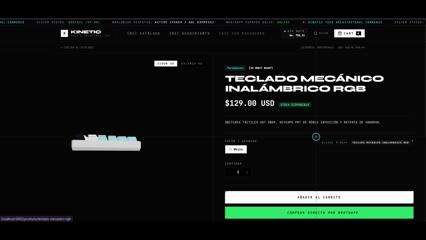
  <p><em>🕹️ Inspección interactiva 3D (Three.js/GLTF): rotación 360°, zoom milimétrico, selección de variantes y conversión automática a tasa BCV.</em></p>
</div>

<br>

## 🖼️ Galería Visual del Frontend (UI/UX)

Para garantizar una experiencia visual ordenada y sin scroll infinito, las interfaces se organizan en las siguientes secciones funcionales:

### 1. Exploración & Landing Page

<table>
  <tr>
    <td width="50%">
      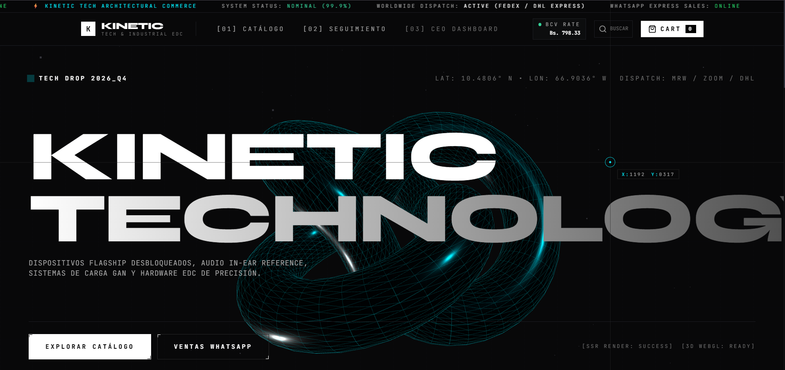
      <br><em><b>Hero Principal:</b> Cabecera minimalista suiza con telemetría en vivo, indicador de estado de red y acceso rápido.</em>
    </td>
    <td width="50%">
      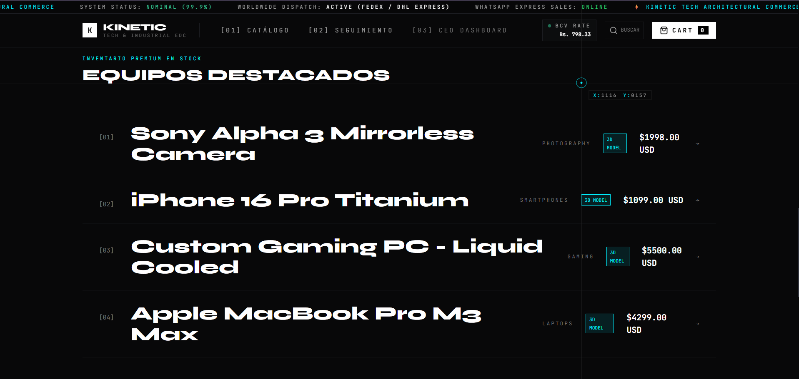
      <br><em><b>Equipos Destacados:</b> Vitrina de hardware modular de alto rendimiento y equipamiento táctico.</em>
    </td>
  </tr>
  <tr>
    <td width="50%">
      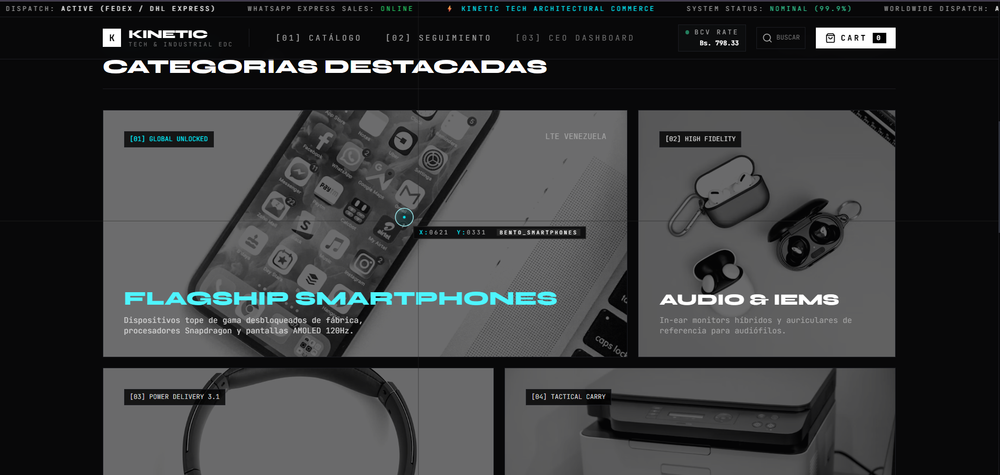
      <br><em><b>Navegación por Categorías:</b> Segmentación rápida para smartphones, laptops, audio y accesorios EDC.</em>
    </td>
    <td width="50%">
      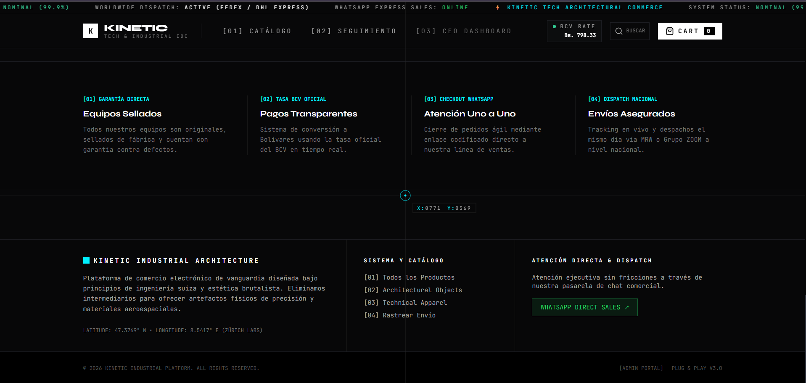
      <br><em><b>Pie de Página Industrial:</b> Monitoreo de estado operativo, políticas de despacho y enlaces de soporte.</em>
    </td>
  </tr>
</table>

### 2. Catálogo Cinético & Vista Detallada de Producto

<table>
  <tr>
    <td width="50%">
      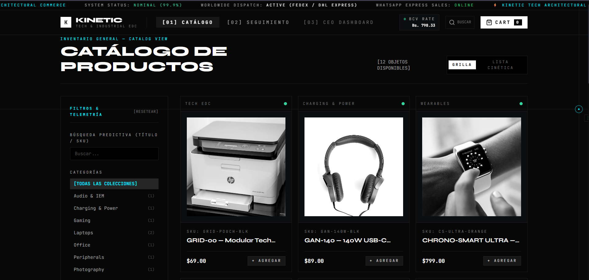
      <br><em><b>Catálogo con Filtrado Dinámico:</b> Búsqueda por precio, categorías y disponibilidad en tiempo real.</em>
    </td>
    <td width="50%">
      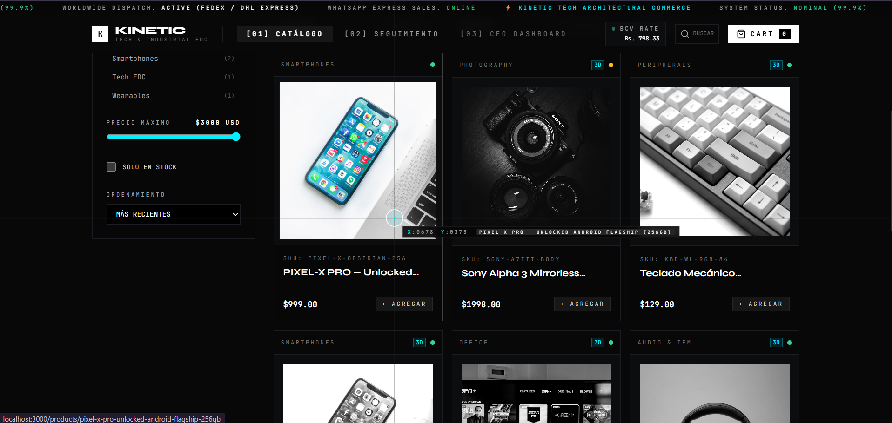
      <br><em><b>Grilla de Productos:</b> Modo grilla y lista cinética con badges de soporte 3D y códigos SKU.</em>
    </td>
  </tr>
  <tr>
    <td colspan="2" align="center">
      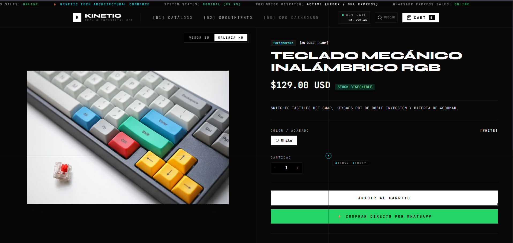
      <br><em><b>Ficha Detallada:</b> Render orbital del modelo 3D, selección de variantes, control de stock y cálculo de conversión multimoneda.</em>
    </td>
  </tr>
</table>

### 3. Carrito, Checkout & Rastreo Satelital

<table>
  <tr>
    <td width="50%">
      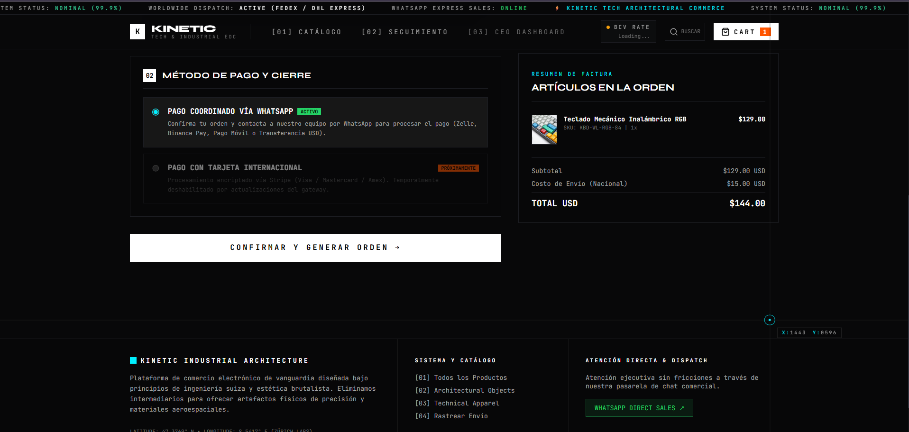
      <br><em><b>Drawer de Carrito:</b> Desglose detallado de ítems, cálculo en USD / Bs y selección de métodos de pago.</em>
    </td>
    <td width="50%">
      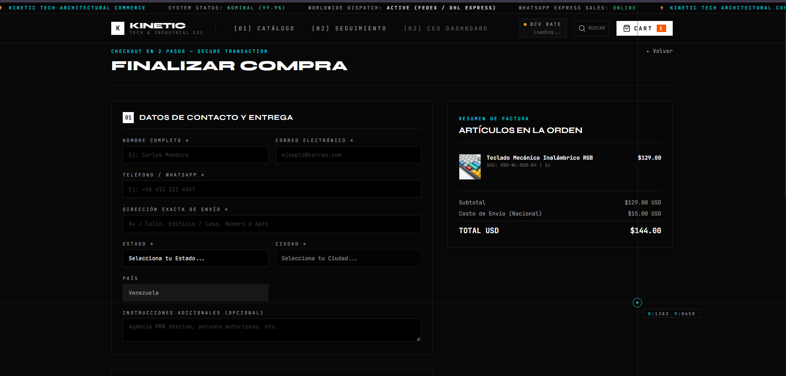
      <br><em><b>Finalizar Compra:</b> Checkout seguro con captura de datos de envío, validación y confirmación.</em>
    </td>
  </tr>
  <tr>
    <td colspan="2" align="center">
      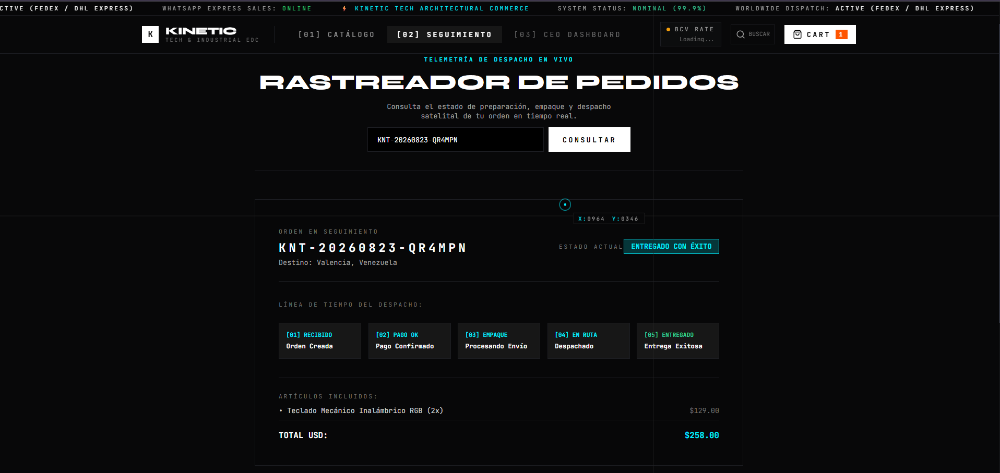
      <br><em><b>Telemetría de Despacho en Vivo:</b> Línea de tiempo interactiva de 5 etapas para rastreo satelital por número de orden o email.</em>
    </td>
  </tr>
</table>

<br>

## 🏗️ Arquitectura y Tecnologías Clave

### Frontend (`apps/storefront`)
*   **Framework:** Nuxt 3 / Vue.js 3 (SSR & Hydration con `useAsyncData`)
*   **State Management:** Pinia (con persistencia reactiva de carrito)
*   **Estilos:** Tailwind CSS con tipografía técnica y paleta brutalista
*   **Interactividad y 3D:** Three.js, GSAP, ECharts, Canvas Confetti

### Backend (`apps/backend`)
*   **Framework:** NestJS
*   **Lenguaje:** TypeScript
*   **ORM:** Prisma ORM
*   **Seguridad y Autenticación:** JWT, Bcrypt, Passport
*   **Documentación de API:** Swagger (`/api/docs`)

### Infraestructura y Datos
*   **Base de Datos:** PostgreSQL 16
*   **Caché:** Redis 7
*   **Contenedores:** Docker & Docker Compose

<br>

<details>
  <summary>🔍 <b>Ver capturas técnicas: Portal de Administración & CEO Dashboard</b></summary>
  <br>
  <p>Herramientas avanzadas de gestión interna y telemetría de negocio protegidas bajo control de acceso basado en roles (RBAC):</p>
  <table>
    <tr>
      <td width="50%">
        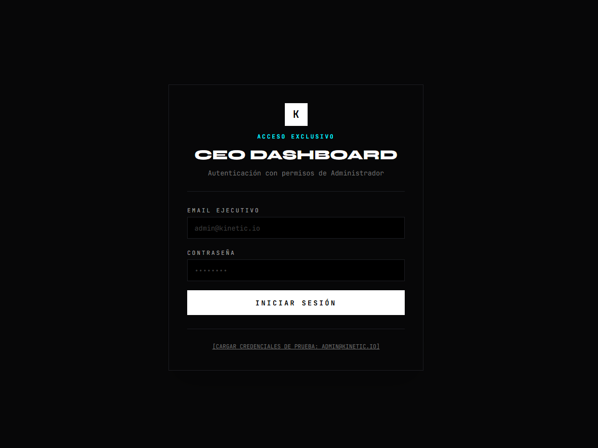
        <br><em><b>Portal de Acceso:</b> Autenticación protegida con control de roles y cifrado Bcrypt.</em>
      </td>
      <td width="50%">
        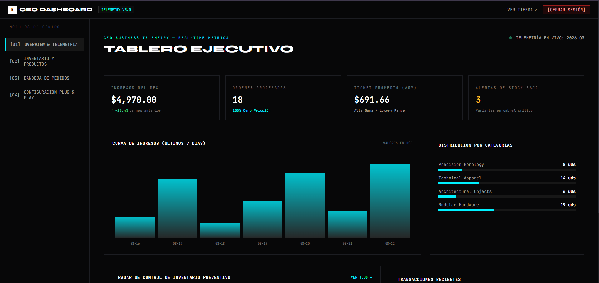
        <br><em><b>Telemetría Ejecutiva:</b> Panel de control con métricas de ventas, ingresos y KPIs en tiempo real.</em>
      </td>
    </tr>
    <tr>
      <td width="50%">
        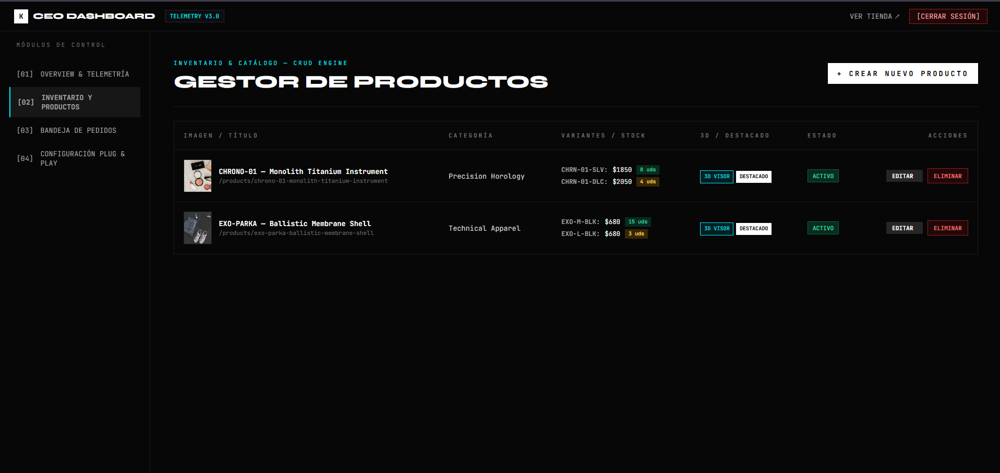
        <br><em><b>Gestión de Inventario:</b> Control total de catálogo, variantes, precios y vinculación de modelos 3D GLTF.</em>
      </td>
      <td width="50%">
        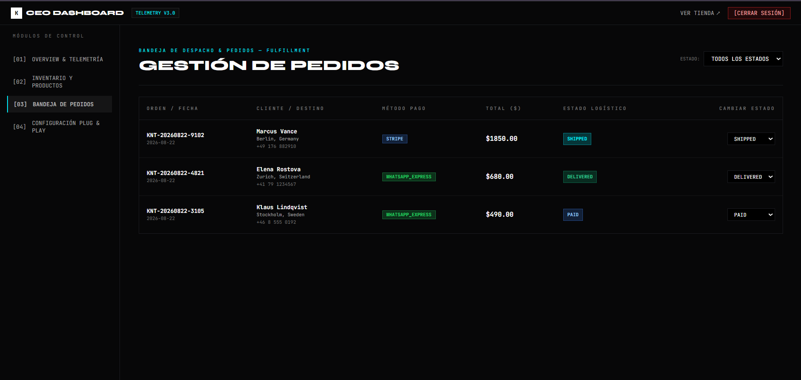
        <br><em><b>Control de Despachos:</b> Actualización de etapas de envío (Recibido, Pago OK, Empaque, En Ruta, Entregado).</em>
      </td>
    </tr>
    <tr>
      <td colspan="2" align="center">
        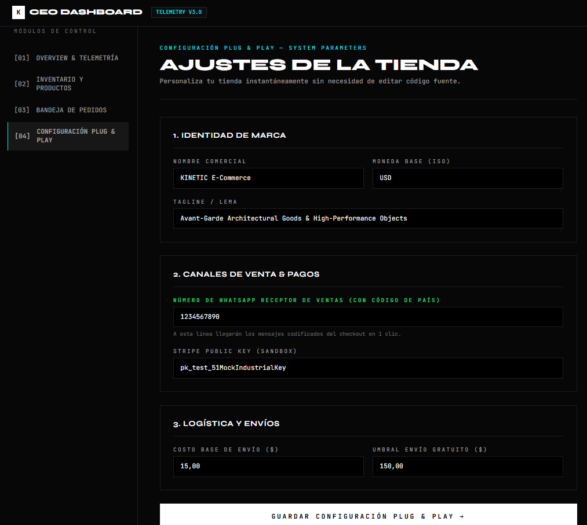
        <br><em><b>Configuración del Sistema:</b> Parámetros operativos de la tienda, datos de contacto y tasa de cambio.</em>
      </td>
    </tr>
  </table>
</details>

<br>

## 📋 Requisitos Previos (Prerequisites)

Para ejecutar este proyecto en tu entorno local, asegúrate de tener instalado:

*   [Node.js](https://nodejs.org/) (v20 o superior recomendado)
*   NPM (viene con Node.js)
*   [Docker](https://www.docker.com/) y [Docker Compose](https://docs.docker.com/compose/) (necesario para levantar los servicios de Postgres y Redis)

## 🛠️ Instalación y Ejecución

Sigue estos pasos para levantar el entorno de desarrollo de forma local:

1. **Clonar el repositorio y acceder a la carpeta principal:**
   ```bash
   git clone <URL_DEL_REPOSITORIO>
   cd catalogo-ecommerce-monorepo
   ```

2. **Instalar dependencias:**
   Al ser un monorepo, este comando instalará las dependencias tanto del root como de las aplicaciones (backend y storefront).
   ```bash
   npm install
   ```

3. **Configurar las variables de entorno:**
   Copia el archivo de ejemplo para configurar tus credenciales y puertos. *(Asegúrate de definir correctamente variables críticas como `DATABASE_URL` y tu `JWT_SECRET`).*
   ```bash
   cp .env.example .env
   ```

4. **Levantar los servicios de infraestructura (Base de Datos y Caché):**
   Asegúrate de que Docker esté corriendo en tu máquina antes de ejecutar este comando.
   ```bash
   docker-compose up -d postgres redis
   ```

5. **Configurar y migrar la Base de Datos:**
   Genera el cliente de Prisma y empuja los esquemas a tu base de datos de desarrollo.
   ```bash
   npm run prisma:generate --workspace=apps/backend
   npm run prisma:push --workspace=apps/backend
   ```
   *(Opcional: Si cuentas con un script de seed configurado, puedes ejecutar `npm run prisma:seed --workspace=apps/backend`)*

6. **Iniciar el entorno de desarrollo:**
   Este comando levantará concurrentemente el servidor de NestJS (Backend) y el servidor de desarrollo de Nuxt (Storefront).
   ```bash
   npm run dev
   ```
   * El Backend estará disponible en: `http://localhost:4000` (API en `/api`, Swagger Docs en `/api/docs`)
   * El Storefront estará disponible en: `http://localhost:3000`

## ☁️ Despliegue (Deployment)

Al ser un monorepo, existen diversas estrategias para llevarlo a producción de manera eficiente:

*   **Frontend (Storefront):** Ideal para ser desplegado en plataformas serverless como **Vercel** o **Netlify**, aprovechando al máximo las capacidades de SSR/SSG de Nuxt 3.
*   **Backend (API & Base de Datos):** Recomendado desplegar en un **VPS** (DigitalOcean, AWS EC2, Linode) o plataformas PaaS como **Render** o **Railway**.
*   **Orquestación con Docker:** Gracias a los archivos `Dockerfile` individuales en cada aplicación y al `docker-compose.yml` en la raíz, toda la solución puede ser orquestada y levantada en un único servidor para simplificar drásticamente el proceso de despliegue.

## 📂 Estructura del Proyecto

```text
catalogo-ecommerce-monorepo/
├── apps/
│   ├── backend/          # ⚙️ API REST, lógica de negocio y esquemas de BD (NestJS + Prisma)
│   └── storefront/       # 🎨 Interfaz de usuario, vistas 3D y componentes (Nuxt 3 + Vue)
├── .env.example          # 🔐 Plantilla de variables de entorno globales
├── docker-compose.yml    # 🐳 Definición de servicios para PostgreSQL y Redis
└── package.json          # 📦 Configuración de scripts y npm workspaces
```

## ✒️ Autor / Contacto

Creado y mantenido por Samuel Ramírez (DevBySam).
* **GitHub:** [@dev-by-sam](https://github.com/dev-by-sam)
* **Portafolio:** [devbysam.is-a.dev](https://devbysam.is-a.dev)
* **Contacto:** devbysamservices@gmail.com
